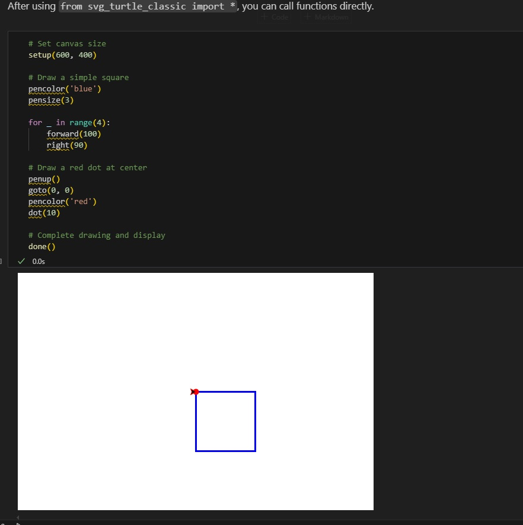

# SVG Turtle Classic

[中文版本](README_zh.md) | [English Version](README.md)



## Acknowledgments

This project is built upon the excellent work of [SaVaGe Turtle](https://donkirkby.github.io/svg-turtle) by Don Kirkby. Special thanks to the original author for creating such a useful library for generating SVG graphics with turtle graphics.

**Original Repository:** https://github.com/donkirkby/svg-turtle

## Overview

SVG Turtle Classic is a wrapper around the svg-turtle library that provides a more familiar interface compatible with Python's classic tkinter turtle module. This enhanced version makes it easier to transition from traditional turtle graphics to SVG generation in Jupyter notebooks and online teaching environments.

## Key Features

- **Three Usage Modes**: Supports procedural, module, and object-oriented styles just like the classic turtle module
- **Seamless Integration**: Drop-in replacement for standard turtle commands
- **Jupyter Notebook Optimized**: Automatically displays SVG output in Jupyter cells
- **Enhanced `done()` Function**: Automatically adds final turtle stamp and displays the result
- **Educational Friendly**: Perfect for teaching programming and creating visualizations
- **Online Teaching Support**: Ideal for code-server demonstrations and remote learning environments
- **Compatibility**: The `speed()` method is available for compatibility with legacy code, though it's an empty function as this module generates static SVG output without animation

## Installation

This project requires the svg-turtle library as a dependency:

```bash
pip install svg_turtle
```

Then simply download or clone this repository and import the `svg_turtle_classic` module.

## Quick Start

```python
from svg_turtle_classic import *

# Set canvas size
setup(600, 400)

# Draw a simple square
pencolor('blue')
pensize(3)

for _ in range(4):
    forward(100)
    right(90)

# Complete and display
done()
```

## Usage Modes

SVG Turtle Classic supports three different usage patterns:

### 1. Procedural Style

```python
from svg_turtle_classic import *
setup(600, 400)
forward(100)
right(90)
done()
```

### 2. Module Style

```python
import svg_turtle_classic as stc
stc.setup(600, 400)
stc.forward(100)
stc.right(90)
stc.done()
```

### 3. Object-Oriented Style

```python
from svg_turtle_classic import Turtle
t = Turtle()
t.forward(100)
t.right(90)
done(t)
```

## Important Notes

- **No Drawing Animation**: Unlike traditional turtle graphics, this module generates static SVG output without drawing animation. Commands are executed and the final result is displayed.
- **Speed Method**: The `speed()` method is included for compatibility with legacy turtle code but is an empty function, as this module doesn't support animation speeds.
- **Online Teaching**: This module is particularly well-suited for online teaching environments, especially code-server demonstrations where students can see the immediate visual results of their turtle graphics code.

## Demo and Examples

For comprehensive examples and detailed usage instructions, please check the demo files in the `demo/` directory:

- `demo/svg_turtle_classic_demo.ipynb` - Complete demonstration notebook with all features
- `demo/svg_turtle_classic_demo_zh.ipynb` - Chinese version of the demo

**Important**: This module is designed specifically for use in Jupyter notebooks (.ipynb files) where SVG graphics can be properly displayed, and is particularly effective in online teaching environments like code-server.

## License

This project is licensed under the MIT License - see the [LICENSE](LICENSE) file for details.

## Contributing

Contributions are welcome! Please feel free to submit issues, feature requests, or pull requests.

---

*Built with ❤️ for the Python education community*
